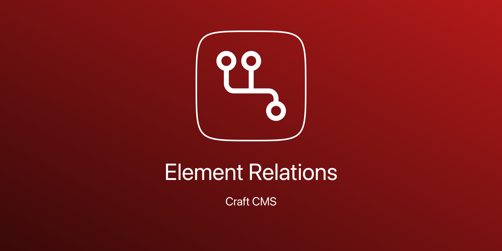
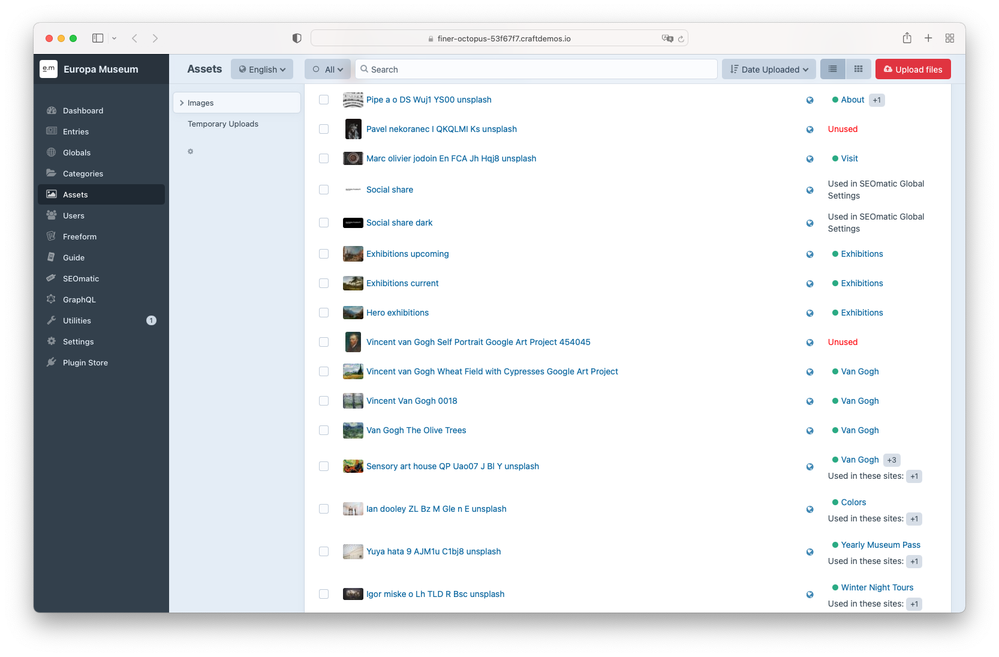
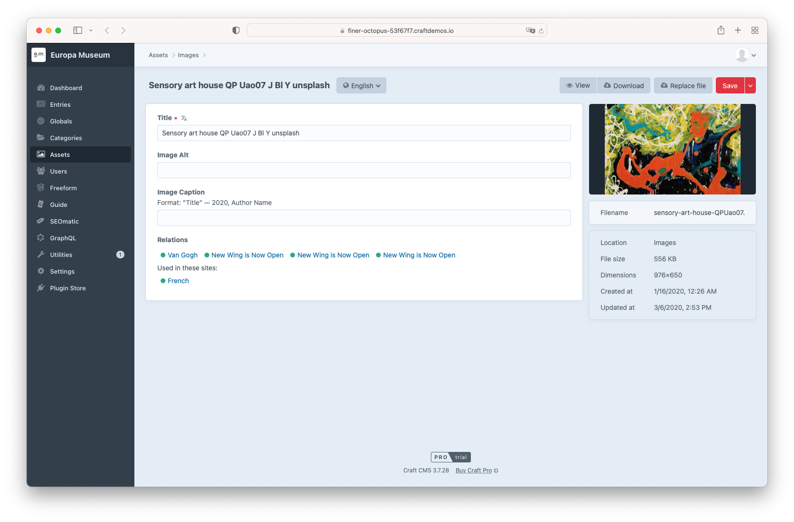
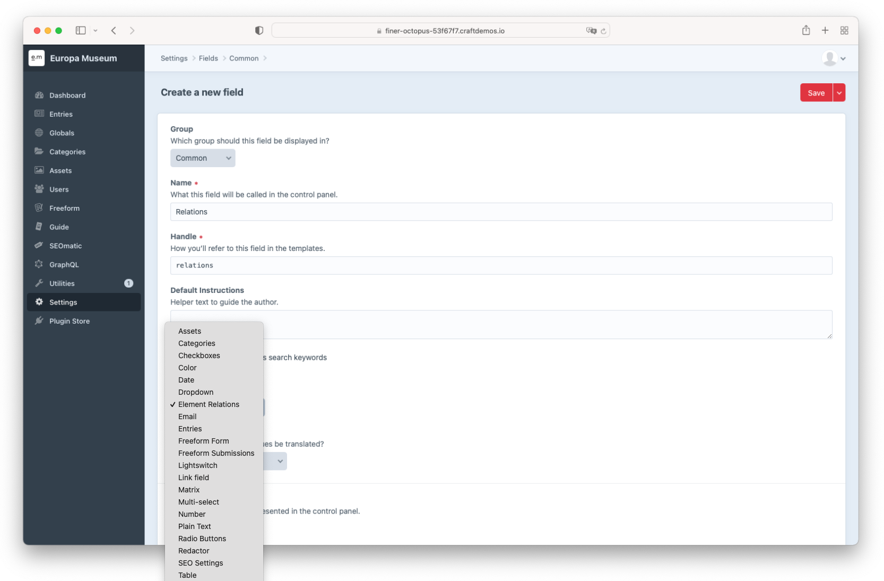
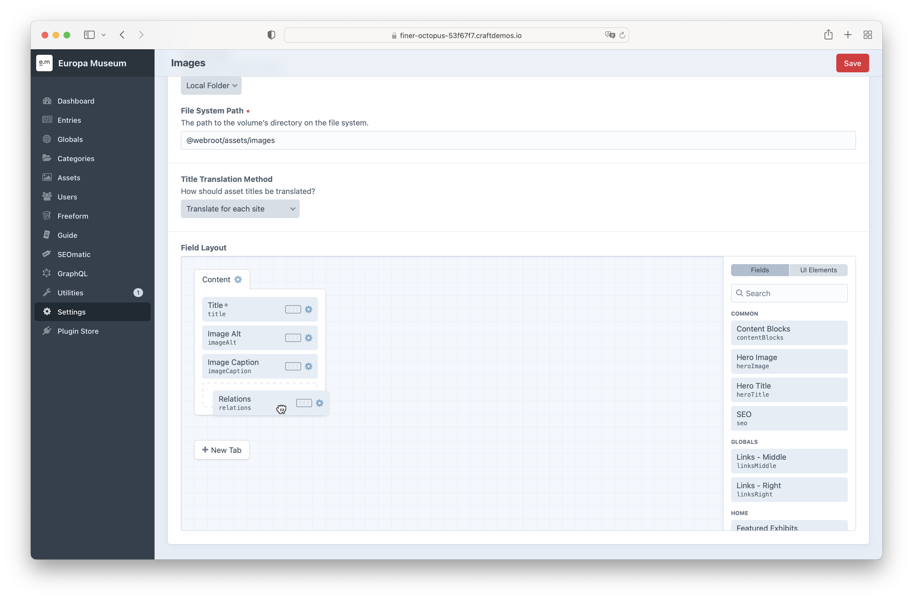

# Element Relations Plugin for Craft CMS 4.x and 5.x

This plugin shows all relations of an element. For example, where an asset, entry or any other element is linked.

__Feature Requests are welcome!__



## Requirements

This plugin requires Craft CMS 4.0.0 or 5.0.0 later.

__For Craft CMS 4:__
When using SEOmatic: MySQL 8.0.17+, MariaDB 10.4.6+, or PostgreSQL 13+ is required.

## Installation
To install this plugin, follow these steps:
1. Install with Composer via `composer require internetztube/craft-element-relations`
2. Install plugin in the Craft Control Panel under Settings > Plugins

You can also install this plugin via the Plugin Store in the Craft Control Panel.

## Support
As a basis the relations table is used. This means that any field that stores relations in the relations table will work out of the box.

* Entries, Assets, Categories, Globals, Users, Products, ... 
* Matrix
* Neo
* SuperTable
* User Photo
* SEOmatic
* Redactor
* CkEditor
* Hyper
* LinkIt
* TypedLinkField   
... and many more.


## Usage in Templates
You would like to use the relation information in your templates, no problemo! There are two methods available for use 
in Twig Templates and Element API.

`elementRelationsGetRelations` and `RelationsService::getRelations` return both an array of Elements. 

### Twig
```twig
{# Expects an Element; Returns an array of Elements. #}


{# Expects an Element; Returns a boolen. #}

```

### Element API / PHP
```php
// Expects Element; Returns an array of Elements
$relations = \internetztube\elementRelations\services\RelationsService::getRelations($element)

// Expects an Element; Returns a boolean.
$seomaticGlobal = \internetztube\elementRelations\services\RelationsService::isUsedInSeomaticGlobalSettings($element);
```

## Screenshots

Asset Overview


---

Asset detail


---

Create Field


---

Add to Field Layout


## Issues
Please report any issues you find to the [Issues](https://github.com/internetztube/craft-structure-disable-reorder/issues) page.


Brought to you by [Frederic Koeberl](https://frederickoeberl.com/)
