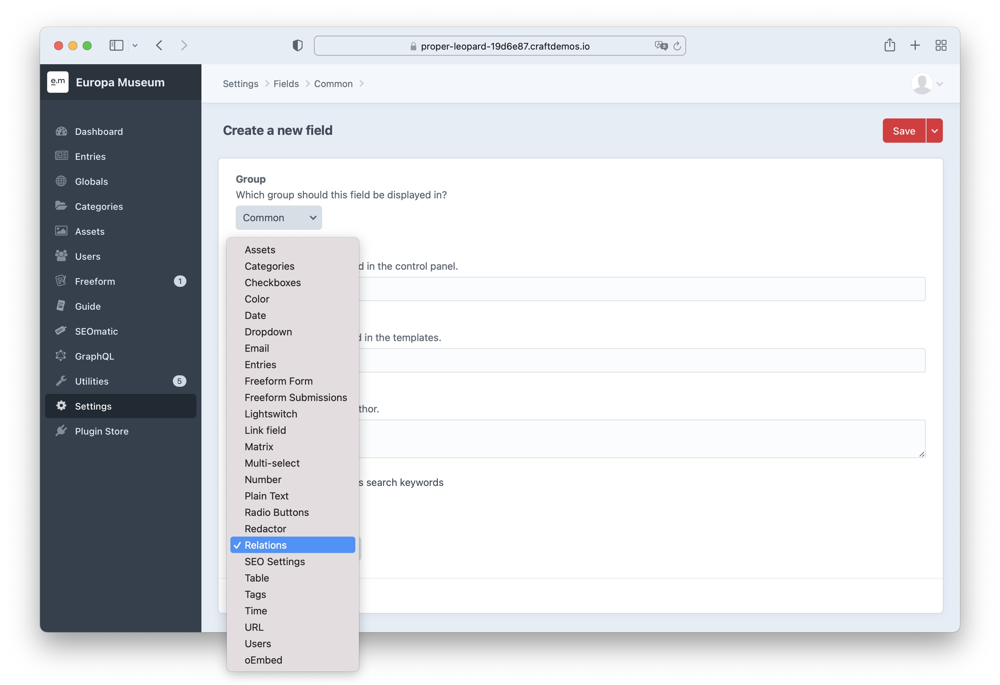
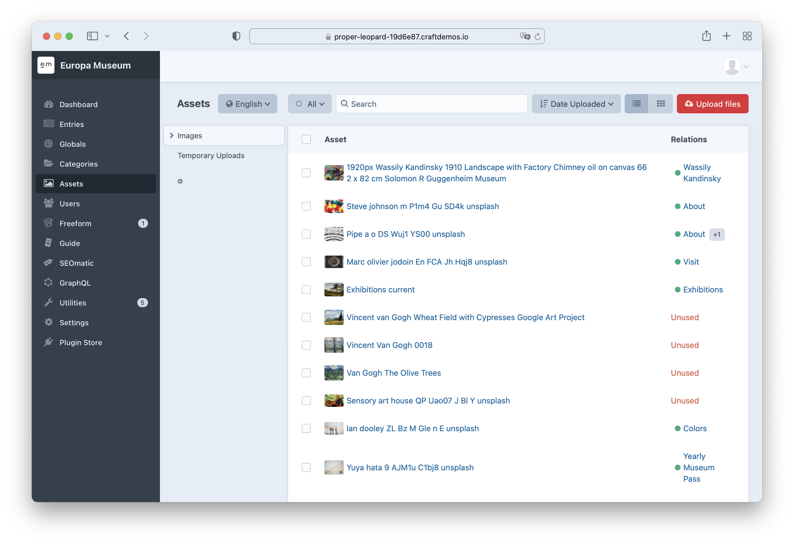
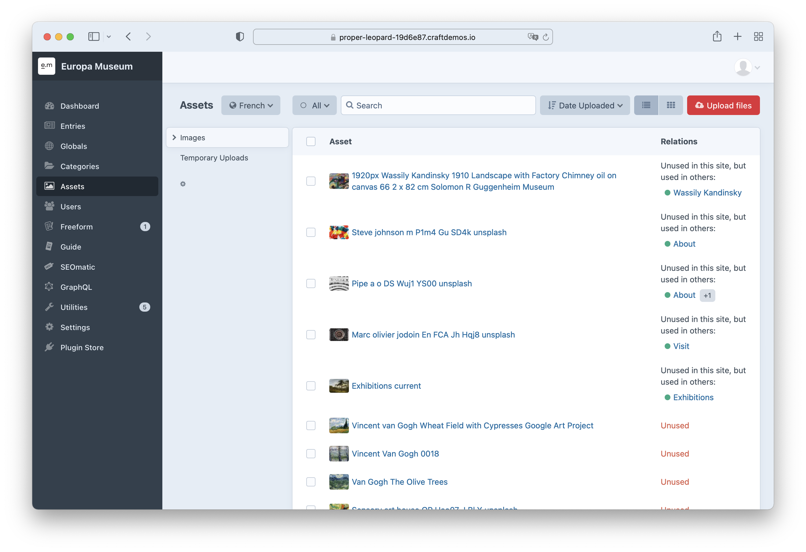
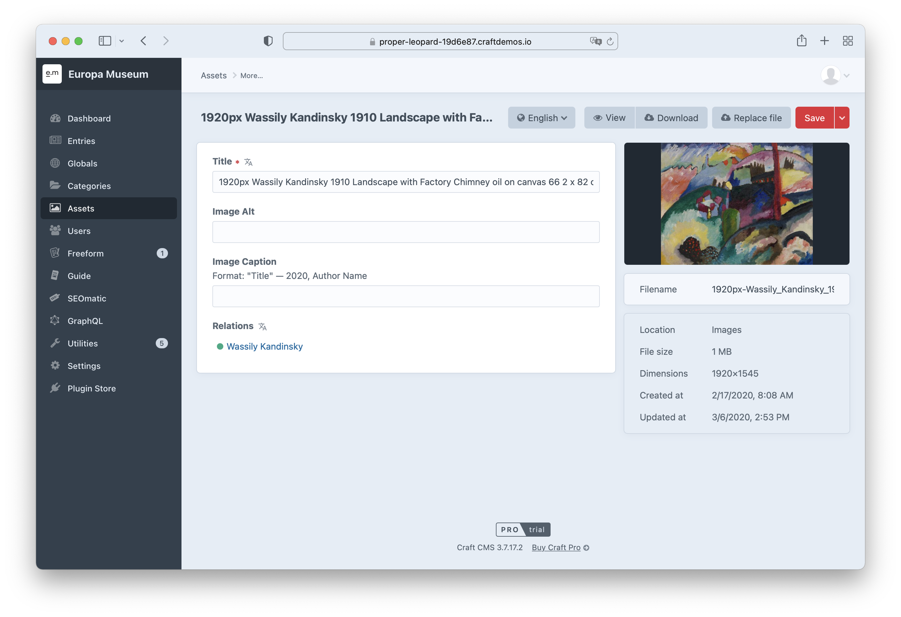

# Element Relations Plugin for Craft CMS 3.x

This plugin shows all relations of an element. For example, where an asset, entry or any other element is linked.

__Feature Requests are welcome!__

## Requirements

This plugin requires Craft CMS 3.0.0-beta.23 or later.

## Installation
To install this plugin, follow these steps:
1. Install with Composer via `composer require internetztube/craft-element-relations`
2. Install plugin in the Craft Control Panel under Settings > Plugins

You can also install this plugin via the Plugin Store in the Craft Control Panel.

## Screenshots

Create Field

Asset Overview Primary Page

Asset Overview Other Page

Asset detail

# Issues
Please report any issues you find to the [Issues](https://github.com/internetztube/craft-structure-disable-reorder/issues) page.

Brought to you by [Frederic Koeberl](https://frederickoeberl.com/)
