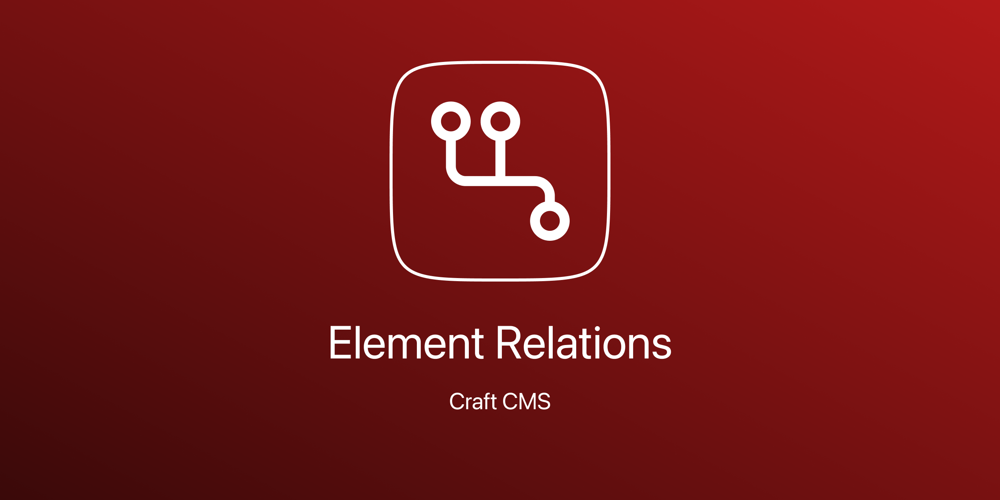
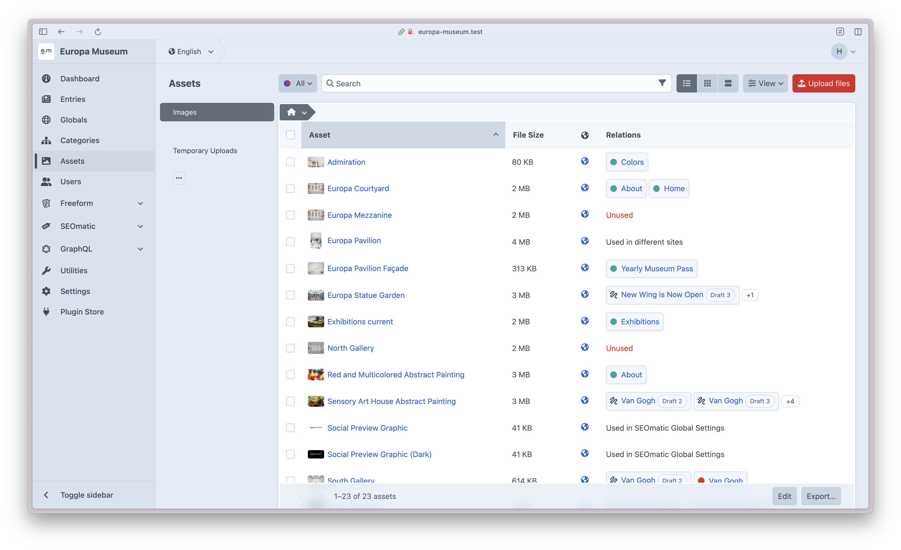
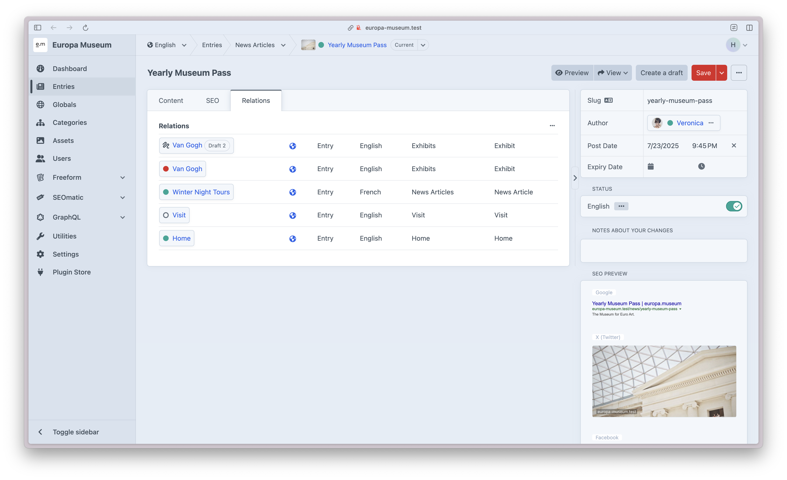
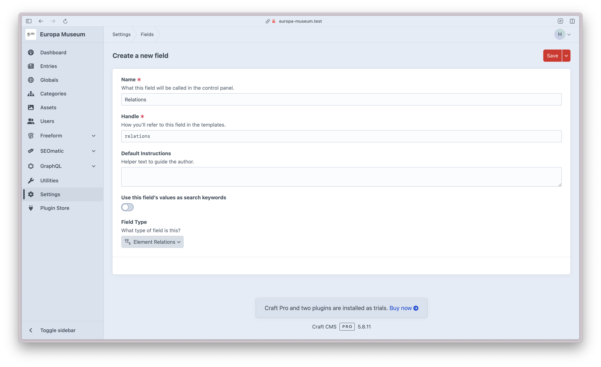
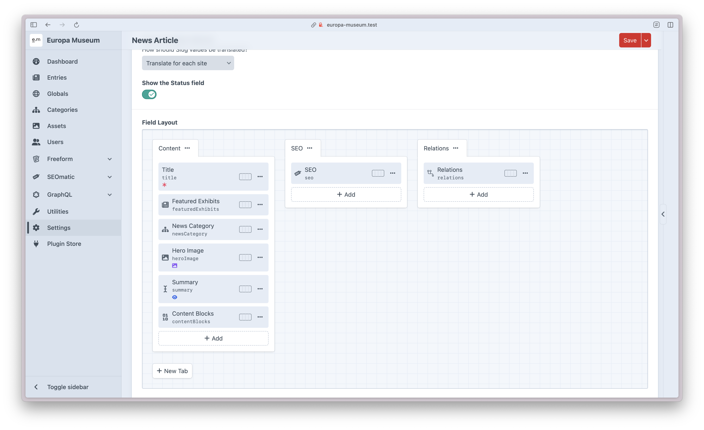

# Element Relations Plugin for Craft CMS 4.x and 5.x

This plugin shows all relations of an element. For example, where an asset, entry or any other element is linked.

__Feature Requests are welcome!__



## Requirements

This plugin requires Craft CMS 4.0.0 or 5.0.0 later.

__For Craft CMS 4:__
When using SEOmatic: MySQL 8.0.17+, MariaDB 10.4.6+, or PostgreSQL 13+ is required.

## Installation
To install this plugin, follow these steps:
1. Install with Composer via `composer require internetztube/craft-element-relations`
2. Install plugin in the Craft Control Panel under Settings > Plugins

You can also install this plugin via the Plugin Store in the Craft Control Panel.

## Support
As a basis the relations table is used. This means that any field that stores relations in the relations table will work out of the box.

* Entries, Assets, Categories, Globals, Users, Products, ... 
* Matrix
* Neo
* SuperTable
* User Photo
* SEOmatic
* Redactor
* CkEditor
* Hyper
* LinkIt
* TypedLinkField
* Formie  
... and many more.

## GraphQL
The Element Relations field exposes its data in GraphQL. Query the field by its handle to
access counts, usage flags, and related elements.

## Usage

### GraphQL
The Element Relations field exposes its data in GraphQL. Query the field by its handle to
access counts, usage flags, and related elements. Below is a minimal example fetching usage
information for a field named `relationsField` on an entry:

```graphql
{
  entry(slug: "my-entry") {
    ... on entry_default_Entry {
      title
      relationsField {
        count
        isInUse
        elements(limit: 2) {
          id
          title
        }
        
        globalCount: count(siteIds: []),
        globalIsInUse: isInUse(siteIds: []),
        globalElements: elements(siteIds: [], limit:2) {
          id
          title
        }
      }
    }
  }
}
```

### Twig
Obtain a `RelationsModel` instance from any element’s relations field, then use its methods to inspect usage.
```twig
{# Fetch the RelationsModel from a field named `relationsField` #}

{# @var relationsModel \internetztube\elementRelations\models\RelationsModel #}

```

#### Is in use?
```twig
{# Check if the element is used in the current site #}

    {# ... #}


{# Check usage across all sites #}

    {# ... #}

```

#### Elements
```twig
{# All related elements in elements site #}


{# All related elements across all sites #}


{# Filter by specific site id(s) #}


{# Limit number of results (e.g., first 2 items) #}


{# All options #}

```

#### Elements Iterator
```twig

    {{ dump(element) }}

```

#### Sites
```twig
{# List of sites where the element is in use #}

```

#### Special / SEOmatic
```twig
{# Detect usage in SEOmatic global settings #}

    {# ... #}

```

## Screenshots

Asset Overview


---

Asset detail


---

Create Field


---

Add to Field Layout


## Issues
Please report any issues you find to the [Issues](https://github.com/internetztube/craft-element-relations/issues) page.


Brought to you by [Frederic Koeberl](https://frederickoeberl.com/)
